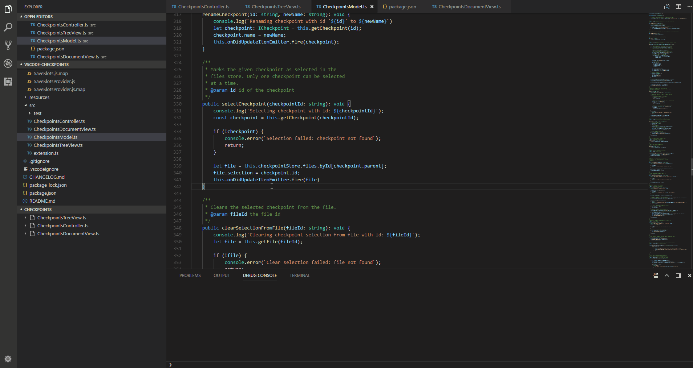
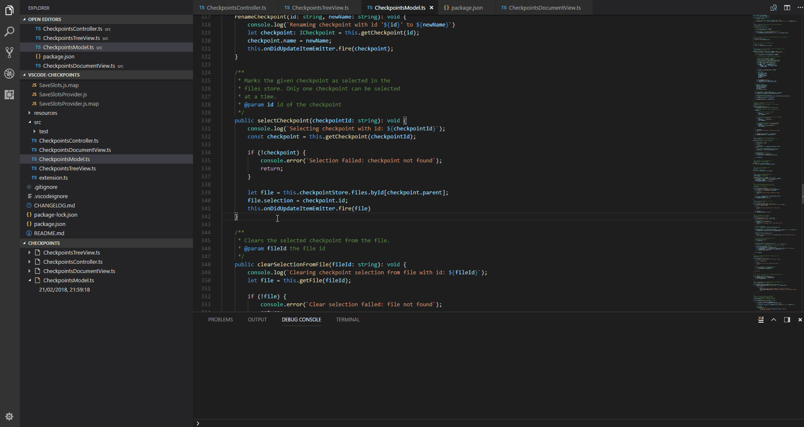
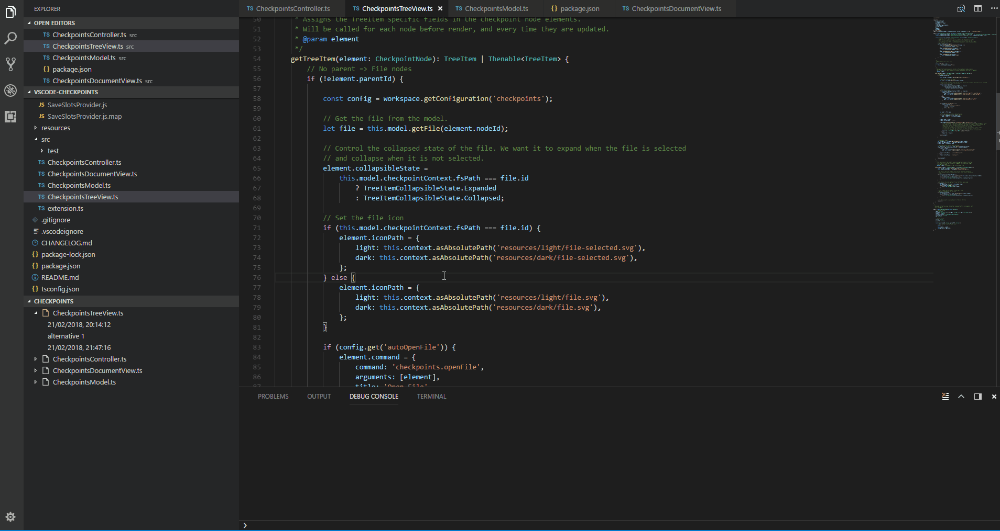

# Checkpoints

Checkpoints used in between commits for keeping a local short-term history of work in progress, like bookmarks in you undo-stack.

## Features

Add a checkpoint of the files current state by running the command `Add Checkpoint` (ctrl+alt+s).

Diff the current version of a file with a checkpoint.

Restore the file to the working state of a previous checkpoint.

## Extension Settings

* `checkpoints.showCheckpointsInExplorer`: show/hide the checkpoints panel in file explorer, can be toggled with the command `Show/Hide Tree View` from the command palette.
* `checkpoints.showCheckpointsInScm`: show/hide the checkpoints panel in source control, can be toggled with the command `Show/Hide Tree View` from the command palette.
* `checkpoints.showActiveFileOnly`: Determines if only the active file should be visible in the tree explorer or not.
* `checkpoints.autoOpenFile`: Determines whether selecting a file in the tree explorer will automatically open the document.
* `checkpoints.autoSelectFile`: Determines whether a file item in the tree explorer will automatically expand/collapse when moving between files.
* `checkpoints.askForCheckpointName`: Show a text input dialog when adding a new checkpoint to specify the checkpoint name. If disabled, the date-time value will be used.
* `checkpoints.locale`: Specifies the date-time locale used for the default checkpoint names.

## Known Issues

* Does not support untitled (unsaved) files.
* Limited support for some checkpoint commands if files are moved/renamed.
